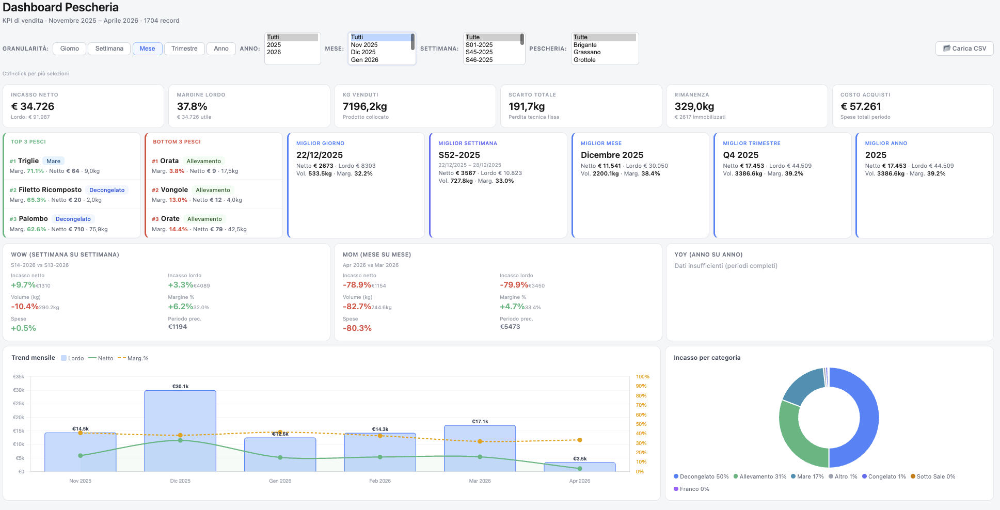

# Fishery Sales Dashboard

An interactive, client-side KPI dashboard for multi-location fishery sales analytics. Built with vanilla HTML/JS and Chart.js — no backend, no build step, no framework. Data loads automatically from Google Sheets (public) or from local CSV files.



---

## Quick start

### Option A — Double-click launcher (macOS, easiest)

Double-click **`Avvia Dashboard.command`** in the project folder. It starts a local HTTP server and opens the dashboard in your browser automatically.

> First time: macOS may ask for confirmation → right-click → **Open** → **Open**.

### Option B — Terminal

```bash
cd "/path/to/fishery-sales-dashboard"
python3 -m http.server 8000
# then open: http://localhost:8000/pescheria_kpi_dashboard.html
```

### Why HTTP server?

The dashboard loads data via `fetch()`. Browsers block network requests from `file://` URLs (CORS policy). An HTTP server — even a local one — bypasses this restriction. Google Sheets also requires HTTP to serve public CSV exports.

### Option C — Manual file upload

Open `pescheria_kpi_dashboard.html` directly in the browser (no server needed) and use the **📂 Carica CSV** and **📂 Carica Actual** buttons to load files manually.

---

## Data sources

The dashboard loads two datasets automatically on startup:

| Dataset | Source | Content |
|---------|--------|---------|
| **Dataset 1** — Fish records | Google Sheets (tab: *Lavoro - Dataset Pesce*) | Daily fish purchases, sales, margins per location |
| **Dataset 2** — Actual cash | Google Sheets (tab: *Lavoro - Entrate/Uscite*) | Real cash register entries and supplier payments |

Google Sheets IDs are hardcoded in `dashboard_script.js` (`autoLoad` function). If Google Sheets is unreachable, the dashboard falls back to local CSV files in the same folder.

**To update the Google Sheets source**, copy `config.example.js` to `config.js` (not tracked in git) and fill in your values:
```javascript
// config.js
window.DASHBOARD_CONFIG = {
  sheetId: 'YOUR_GOOGLE_SHEET_ID',
  ds1Gid:  'YOUR_DS1_GID',   // tab: Dataset Pesce
  ds2Gid:  'YOUR_DS2_GID',   // tab: Entrate/Uscite
};
```

> `config.js` is listed in `.gitignore` — credentials never reach the repository.

---

## Features

### Collapsible sections (all closed by default)

| Section | Contents |
|---------|----------|
| 📊 **Overview** | KPIs, WoW/MoM/YoY, Trend chart, Category donut, Pareto curve (lordo + netto), Waterfall margin, Heatmap day×fish (lordo + netto), Weather impact, Supplier donut |
| 🐟 **Analisi pesci e margini** | 100% stacked fish bar, Revenue Map 4 quadrants, Fish detail table |
| 🎛️ **Simulatore pricing** | Interactive sliders to simulate margin impact of price/quantity changes |
| 📊 **Actual vs Fish Record** | DS2 vs DS1 comparison: KPIs, WoW cards, Waterfall actual, 5 comparison charts, detail table with delta comments |
| 📅 **Pre/Post 10/02/2026** | Analysis of the operational schedule change |
| 🗃️ **Dati grezzi** | All filtered rows from Dataset 1, sortable |

### Filters

- **Granularity**: Day (with weekday name) · Week · Month · Quarter · Year
- **Cascading multi-select**: Year → Month → Week → Location → Supplier (Ctrl+click for multiple)
- **Day-of-week filter**: multi-select Monday–Sunday
- All filters apply to both datasets simultaneously

### Cross-filtering (Power BI style)

Click any chart to filter all others. Supported types:

| Type | Activated by |
|------|-------------|
| `cat` | Category donut |
| `fish` | Fish bar, Revenue Map, table row |
| `supplier` | Supplier donut |
| `pe` | Location (Pre/Post charts) |
| `trend` | Trend bar chart |

Active filter shown as badge with one-click reset.

### Charts

| Chart | Description |
|-------|-------------|
| Trend | Gross/net bars + margin % line (secondary axis). Clickable for cross-filter |
| Category donut | % distribution of gross revenue by category. Value labels on slices |
| Pareto (lordo) | Fish sorted by gross revenue. Blue = top 80%, orange cumulative line, red 80% threshold |
| Pareto (netto) | Same but sorted by net margin |
| Waterfall (Fish) | Gross → -Purchases → -Waste → Net. Labels show € and % of gross |
| Heatmap (lordo) | Rows = weekdays, columns = all fish. Tricolor: red→orange→green |
| Heatmap (netto) | Same but by net margin |
| Weather impact | Average daily gross/net by weather condition |
| Revenue Map | Bubble chart with 4 quadrants: 🌟 Star / 📦 Volume / 💎 Premium / ⚠️ Review |
| Supplier donut | Spend % per supplier with € value labels on slices |
| Fish bar | 100% stacked: green = margin %, grey = costs. Sorted by margin % desc |

### Actual vs Fish Record

Compares Dataset 2 (real cash) against Dataset 1 (fish records). Join key: **Date + Location**.

| Metric | Dataset 1 | Dataset 2 |
|--------|-----------|-----------|
| Gross revenue | Σ(Qv × Pv) | Cash register entries |
| Supplier costs | Σ(Qa × Pa) | Actual supplier payments |
| Extra costs | Not present | Fuel, other expenses |
| Net | Gross − Costs | Cash − All costs |

Delta cells show contextual comments:
- **Δ Gross**: 📈 "Hai incassato più del previsto!" / 📉 "Hai incassato meno"
- **Δ Supplier**: 💰 "Sconto fornitori!" / ⚠️ "Pagato molto di più — verifica entry mancanti" (threshold >€100)
- **Δ Net**: 🏆 "Margini rispettati!" / 🚨 "Margine molto sotto la stima"
- **Neutral** (|diff| < €1 or < 0.5pp): ✓ "Match aspettative"

### Pricing simulator

Select a fish → sliders auto-populate with historical averages (filtered period). Adjust price, purchase cost, kg ordered, waste %, leftover % to see real-time impact on net margin.

### Highlights

- **Top 3 / Bottom 3 fish** by margin %
- **Best day / week / month / quarter / year** — net, gross, volume, margin %

---

## Project structure

```
fishery-sales-dashboard/
├── pescheria_kpi_dashboard.html   # Full app (HTML + inline CSS)
├── dashboard_script.js            # All JS logic
├── Avvia Dashboard.command        # macOS double-click launcher
├── sample_data.csv                # Sample data (Dataset 1 structure reference)
├── Screenshot.png                 # Dashboard screenshot
├── README.md                      # This file
├── GUIDELINES.md                  # Development guidelines
└── .gitignore
```

> Real CSV files and the Google Sheet are not included in this repository.

---

## Data pipeline

### 1. Automatic deduplication

Primary key (9 fields): `Date · Location · Fish (normalized) · Supplier · Category · Qty · Purchase price · Sale price · Leftover qty`

Rows with identical keys are dropped at parse time. The source file is never modified.

### 2. Fish name normalization

90+ raw variants → 51 canonical names via `FISH_NORM()`. Normalization runs before deduplication.

See the full mapping table in the **[Fish name normalization](#2-fish-name-normalization)** section below.

### 3. Italian number format parsing

Handles: `"8,50 €"` / `"€ 141,00"` / `"35,61%"` / `"26,4"` — comma decimal, period thousands, € symbol.

### 4. Calculation formulas

Values are read directly from the CSV (already computed by Excel):

| Metric | Formula | CSV column |
|--------|---------|------------|
| Purchase cost | `Qty × Purchase price` | `Spese` |
| Gross revenue | `Qty sold × Sale price` | `Incasso (lordo)` |
| Net revenue | `Gross − Purchase cost` | `Incasso (netto)` |
| Margin % | `Net / Gross × 100` | `Margine Lordo (%)` |
| Qty sold | `Qty − Waste − Leftover − Discarded` | `Qta. Venduta (Kg)` |

**Aggregated margin %** = volume-weighted average: `Σ(Net) / Σ(Gross) × 100`

### 5. Delta neutrality threshold

All delta cells use a neutrality threshold to avoid false alarms on rounding noise:
- Monetary deltas: neutral if `|diff| < €1`
- Margin % deltas: neutral if `|diff| < 0.5pp`

### 6. Pre/Post 10/02/2026 analysis

Cutoff date: `CUTOFF_PP = new Date(2026, 1, 10)`

Schedule change:
- **Pre**: Grassano + Grottole operated together Mon/Wed/Fri
- **Post**: Thu = Grottole, Fri = Grassano, Mon = Grassano, Tue = Grottole, Wed = Grassano

---

## Fish name normalization

### Explicit normalization map (90+ variants → 51 canonical names)

| Raw variants in CSV | Canonical name |
|--------------------|----------------|
| `Coda di rospo`, `Code di rospo` | `Coda di Rospo` |
| `Cozza grecia`, `Cozze grecia` | `Cozze Grecia` |
| `Cozza pelosa` | `Cozze Pelosa` |
| `Cozza sfusa` | `Cozze Sfusa` |
| `Cozze sfuse` | `Cozze Sfuse` |
| `Cozza treccia`, `Cozze treccia` | `Cozze Treccia` |
| `Cozze spagna` | `Cozze Spagna` |
| `Cozze` | `Cozze` |
| `Gamberi 20/30` | `Gamberi 20/30` |
| `Gamberi salipci` | `Gamberi Salipci` |
| `Gamberoni l1`, `L1 Argentino` | `Gamberoni L1` |
| `Gamberi` | `Gamberi` |
| `Merluzzi`, `Merluzzo`, `Merluzzo 1`, `Merluzzo prima` | `Merluzzo Prima` |
| `Merluzzo 2`, `Merluzzo seconda` | `Merluzzo Seconda` |
| `Orata`, `Orate`, `Orata a`, `Orate a` | `Orata A` |
| `Orata g`, `Orate g` | `Orata G` |
| `Pancasio`, `Pangasio` | `Pangasio` |
| `Pesce spada` | `Pesce Spada` |
| `Persico`, `Filetto persico` | `Filetto Persico` |
| `Pescatrice`, `Pescatrici` | `Pescatrice` |
| `Pescatrice 50/100` | `Pescatrice 50/100` |
| `Polpi`, `Polpo`, `Polipo` | `Polpo` |
| `Polpo T7`, `Polpo  T7` | `Polpo T7` |
| `Polpo T4` | `Polpo T4` |
| `Polpi t8`, `Polpo t8`, `Polipi t8`, `Polipo t8` | `Polpo T8` |
| `Raia`, `Raya`, `Razza` | `Razza` |
| `Razza pulita` | `Razza Pulita` |
| `Sarde` | `Sarde` |
| `Scampi` | `Scampi` |
| `Sfusa grecia` | `Sfusa Grecia` |
| `Seppia`, `Seppie` | `Seppia` |
| `Seppia 10/20`, `Seppie 10/20`, `Seppia pulita 10/20`, `Seppie pulite 10/20` | `Seppia Pulita 10/20` |
| `Seppia cioco`, `Seppie cioco` | `Seppia Cioco` |
| `Seppia pulita`, `Seppie pulita`, `Seppie pulite` | `Seppia Pulita` |
| `Seppia sporca` | `Seppia Sporca` |
| `Seppie 20/40` | `Seppie 20/40` |
| `Seppie pulita gold` | `Seppia Pulita Gold` |
| `Ombrina`, `Ombrine` | `Ombrina` |
| `Sogliola` | `Sogliola` |
| `Sogliola (lingua)` | `Sogliola Lingua` |
| `Sogliola tigri`, `Sogliole tigri`, `Sogliola(TIgri)`, `Sogliola (tigri)` | `Sogliola Tigri` |
| `Sogliola tigre` | `Sogliola Tigre` |
| `Spigola`, `Spigole`, `Spigola a` | `Spigola A` |
| `Spigola g`, `Spigole g` | `Spigola G` |
| `Spigole 2g` | `Spigole 2G` |
| `Spigole 3g` | `Spigole 3G` |
| `Baccala Congelato` | `Baccalà Congelato` |
| `Baccalà salato` | `Baccalà Salato` |
| `Vongole`, `Vongole v.`, `Vongole veraci` | `Vongole Veraci` |
| `Vongole lupini` | `Lupini` |
| `Lupini mega` | `Lupini Mega` |
| `Lupini` | `Lupini` |

### Passthrough names (title-case fallback, no explicit mapping needed)

Alici · Anguille · Astice · Calamari · Cefalo · Cicala · Datterino · Filetto Ricomposto · Gallinella · Lanzardo · Melù · Noci Bianche · Obrina · Ostriche · Palombo · Paranza · Ricciola · Ricomposto · Salmone · Sbani · Serra · Sgombro · Suri · Tonno · Triglie · Trote Salmonate · Violette · Scampi

---

## Dependencies

| Library | Version | Purpose |
|---------|---------|---------|
| [Chart.js](https://www.chartjs.org/) | 4.4.1 | All charts |

Loaded via CDN. No Node.js, no build step, no other dependencies.

---

## Browser compatibility

Chrome 120+, Firefox 121+, Safari 17+. Requires ES2020. Must be served via HTTP (not `file://`).

---

## License

MIT — free to use, modify and distribute with attribution.
